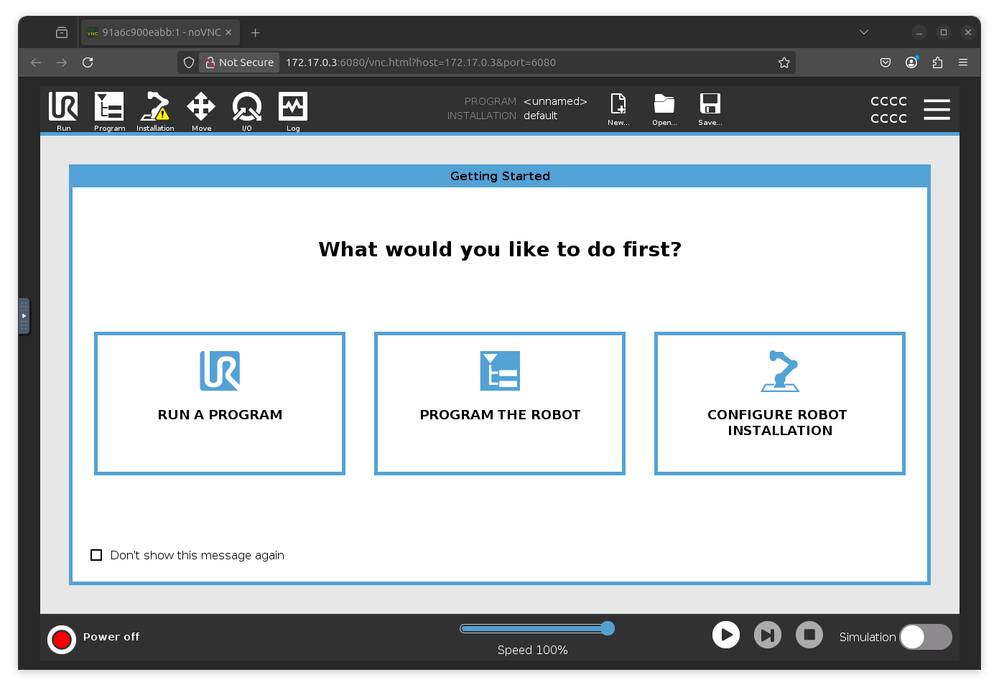
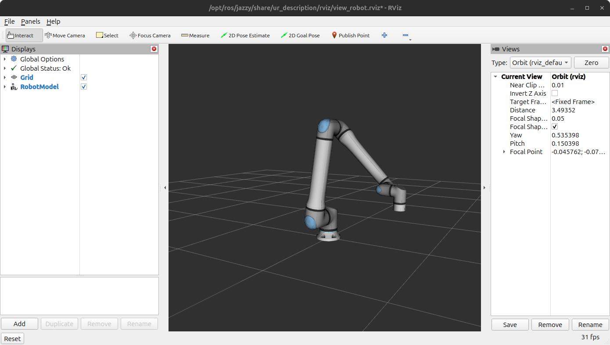
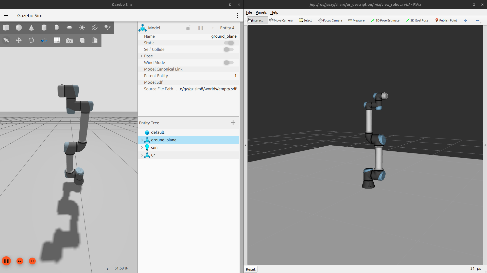

# Estación de trabajo virtual: Polyscope (browser) y simulador (Rviz)

### Requisitos del sistema:
 - [x] Ubuntu 24.04 lts
 - [x] ROS2 (Humble/Jazzy/Rolling)
 - [x] Docker

## Polyscope (Browser)

La interfaz de usuario de UR Polyscope se puede ejecutar de 2 maneras: directamente por Docker o por ROS2. En ambos casos se creará un contenedor de Docker que expondrá 2 puertos dedicados a comunicar, a través de una VPN, la interfaz gráfica de Polyscope.

### Opción 1: Docker (recomendado)

Ejecutar el siguiente comando:

``` bash
docker run --rm -it \
    -p 5900:5900 -p 6080:6080 \
    -v "${HOME}/Projects/UR_robotics/ur5_devs:/ursim/programs" \
    -e ROBOT_MODEL=UR5 \
    --network=ursim_net \
    universalrobots/ursim_e-series
```

De esta manera tenemos más control sobre el contenedor y podemos gestionar la red de comunicación hacia otros contenedores y simuladores.

<!-- Opción 2: ROS2 -->
<details>
  <summary>

  ### Opción 2: ROS2

  </summary>
    
  > [!NOTE]
  > 1. Se recomienda tener nociones de desarrollo en ROS2 para usar esta opción.
  > 2. Se necesita tener instalado el paquete Universal_Robots_ROS2_Driver correctamente compilado. En la siguiente sección *"Simulador (Rviz)"* se describe cómo instalar el paquete. 

  ``` bash
  source /opt/ros/{$ROS_DISTRO}/setup.bash  # Source ROS2
  source $COLCON_WS/install/setup.bash      # Source del workspace
  ros2 run ur_client_library start_ursim.sh -m ur20
  ```

De esta manera obtenemos el mismo resultado, un link que tiene acceso a un contenedor donde se estará ejecutando una aplicación web de Polyscope.

</details>

---

### Vista de la interfaz:




## Simulador (Rviz)

Primero, se necesita instalar el package _**ur_robot_driver**_ y las dependencias necesarias para ejecutar el programa. La documentación de UR nos proporciona el [tutorial para instalar el package](https://docs.universal-robots.com/Universal_Robots_ROS2_Documentation/doc/ur_robot_driver/ur_robot_driver/doc/installation/installation.html).

> [!WARNING]
> **Siempre siempre siempre siempreeeee** antes de instalar algún programa o paquete en Linux Ubuntu actualizar la lista de paquetes:
> ``` bash
> sudo apt update && apt upgrade
> ```

Con el paquete previamente instalado:

``` bash
cd $COLCON_WS
source install/setup.bash
ros2 launch ur_robot_driver \
     ur_control.launch.py \
     ur_type:=ur5 \
     robot_ip:=<ip_of_polyscope> \
     launch_rviz:=true
```
> [!NOTE]
> Para que el simulador pueda detectar el valor de los estados del robot, primero tiene que estar corriendo el contenedor de Docker.

Para mostrar el estado (posición y velocidad) de las articulaciones:
``` bash
ros2 topic echo /joint_states
```

O para una mejor vista:

``` bash
ros2 topic echo /joint_states --filter \
    "print(
    f'\n  Joint\t  Base\tShoulder Elbow\tWrist1\tWrist2\tWrist3\n'
    f'Position {m.position[0]:.3f}\t{m.position[1]:.4f}\t{m.position[2]:.4f}\t{m.position[3]:.4f}\t{m.position[4]:.4f}\t{m.position[5]:.4f}\n'
    f'Velocity {m.velocity[0]:.3f}\t{m.velocity[1]:.4f}\t{m.velocity[2]:.4f}\t{m.velocity[3]:.4f}\t{m.velocity[4]:.4f}\t{m.velocity[5]:.4f}'
    ) or False"
```

### Vista de la interfaz:



## Simulador completo

Al ejecutar ambos programas tenemos una estación robot-teachpendant completamente virtual:


## Networking

Para que la aplicación pueda establecer una comunicación con otros dispositivos físicos (PLCs, computadoras, etc) debemos crear una sub-red de docker que haga un bridge hacia nuestra red local (LAN) con el siguiente comando:

``` bash
docker network create -d ipvlan --subnet=192.168.100.0/24 --gateway=192.168.100.1 -o parent=wlp0s20f3 urnet_lab_test
```

Para este ejemplo, se realizó un bridge de tipo ```ipvlan``` que hace que nuestro dispositivo actúe como un router virtual y le asigne a nuestros contenedores una dirección ip virtual, pero que pueden ser contactados desde la red. Para esto utiliza la interfaz de red inalámbrica ```wlp0s20f3``` (previamente identificado).

De esta manera ya se puede inicializar el contenedor con la sub-red de docker creada:

``` bash
docker run --rm -d -p 5900:5900 -p 6080:6080 -p 502:502 -v "/home/angmolgo/Projects/UR_robotics/ur5_devs/modbus_plc_connection/robot_scripts:/ursim/programs" -e ROBOT_MODEL=UR5 --net urnet_casa_test --ip 192.168.100.101 universalrobots/ursim_e-series
```
> [!NOTE]
> Se debe crear una nueva sub-red de docker cada vez que cambie el número de red (te conectas a una red nueva y cambie la red XXX.XXX.XXX...).
> Se deberá contactar con el administrador de la red para realizar la asignación de IPs.
> Si se realiza la asignación de IPs a través de la dirección MAC, se debe usar una sub-red de tipo ```macvlan```.

Para este punto, los contenedores van a tener su propia ip y podrán ser contactados por otros dispositivos en la misma red, por lo que exponer los puertos 5900, 6080 y 502 ya no será necesario.

### Conexión interna

> [!NOTE]
> Al usar una sub-red del tipo ```ipvlan``` adscrito a la tarjeta de red del dispositivo, el host no podrá establecer una comunicación directa con el contenedor, será una ip "inalcanzable".

Para esto se deberá crear una nueva interfaz de red virtual en el dispositivo (por así decirlo, una "tarjeta de red virtual") que permitirá acceder a las IPs virtuales de la sub-red de docker.

``` bash
sudo ip link add ipvlan0 link wlp0s20f3 type ipvlan mode l2
```

Luego asignaremos una ip falsa:

``` bash
sudo ip addr add 192.168.100.199/24 dev ipvlan0
```

Y por último, habilitarla:

``` bash
sudo ip link set ipvlan0 up
```

De esta manera se puede exponer los contenedores a la red local y poder seguir interactuando con ellos desde sockets internos en el mismo dispositivo.
Esto es útil para exponer los contenedores a la red, que se puedan comunicar, por ejemplo, con un PLCs  y poder correr simulaciones de ROS2 con la misma computadora.

### Conexión desde una tableta electrónica

Una implementación de esta aplicación es abrir el url del contenedor en una tableta, de esta manera pretendemos tener un teach-pendant en nuestras manos para controlar a nuestro robot simulado.


### Conexión Modbus mediante una red virtual

También se puede establecer una comunicación entre dos contenedores vía Modbus a través de la sub-red de Docker.


# Simulador en ROS2 Gazebo (adicional)

Adicionalmente podemos conectar la simulación de Rviz con el simulador Gazebo para simular el robot en un entorno 3D dinámico, interactuando con otros robots, objetos y sensores.

1. Crear el workspace:

``` bash
# Creamos el workspace
mkdir ws_ROS2_ursim && cd ws_ROS2_ursim
export COLCON_WS=$PWD
mkdir -p $COLCON_WS/src
# Descargamos el package de URsim
git clone -b ros2 https://github.com/UniversalRobots/Universal_Robots_ROS2_GZ_Simulation.git src/ur_simulation_gz
# Instalamos dependencias
source /opt/ros/jazzy/setup.bash #...primero debemos obtener ROS2...
rosdep update && rosdep install --ignore-src --from-paths src -y
# Compilamos el paquete
cd $COLCON_WS
colcon build --symlink-install
```

2. Para ejecutar el paquete:

``` bash
source /opt/ros/jazzy/setup.bash
source $COLCON_WS/install/setup.bash
ros2 launch ur_simulation_gz ur_sim_control.launch.py
```

3. Para realizar un movimiento de prueba (hola mundo):

``` bash
ros2 run ur_robot_driver example_move.py
```



---

### Para clonar este repositorio
``` bash
# Debido a que contiene repositorios "anidados" se deben tratar como sub-módulos.
# Para clonar el repositorio con los submódulos:
git clone --recurse-submodules https://github.com/AngMolGo/UR_Robotics
```

---

### Referencias y ligas de interés:
- Análisis comparativo entre RoboDK y ROS: https://www.researchgate.net/publication/348312857_Comparative_Analysis_of_RoboDK_and_Robot_Operating_System_for_Solving_Diagnostics_Tasks_in_Off-Line_Programming
- Documentación DockerHub de contenedor de Universal Robots: https://hub.docker.com/r/universalrobots/ursim_e-series
- Repositorio de Universal_Robots_ROS2_Driver: https://github.com/UniversalRobots/Universal_Robots_ROS2_Driver
- Guía de instalación de ROS2 Jazzy: https://docs.ros.org/en/jazzy/Installation.html
- Guía de instalación de Docker Engine en Ubuntu: https://docs.docker.com/engine/install/ubuntu/
- Tutorial oficial de ROS2: https://docs.ros.org/en/jazzy/Tutorials.html
- Tutorial oficial de Docker: https://docs.docker.com/get-started/introduction/whats-next/
- Documentación de redes ipvlan de docker: https://docs.docker.com/engine/network/drivers/ipvlan/#ipvlan-l2-mode-example-usage